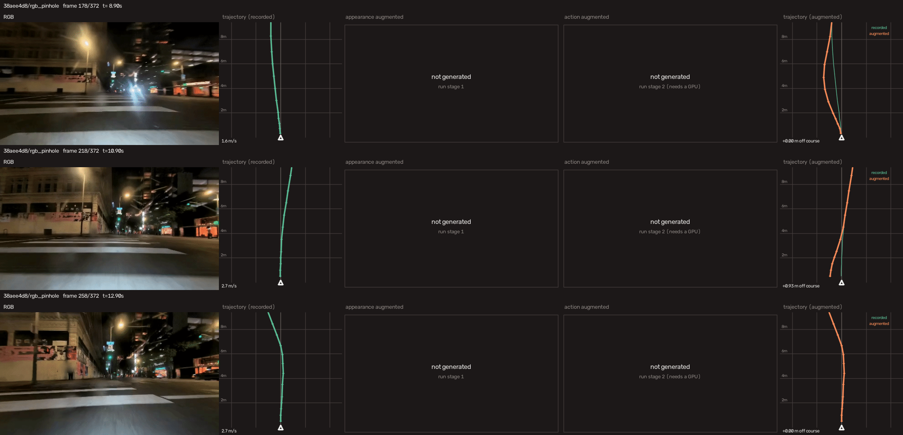

# MIMIC

Official implementation of **"Learning Sidewalk Autopilot from Multi-Scale Imitation with Corrective Behavior Expansion"** (ICRA 2026).

[](https://arxiv.org/abs/2603.22527)
[](https://arxiv.org/abs/2603.22527)
[](https://huggingface.co/UCLA-VAIL/Navigation-Model-Zoo-Public)

## Release Plan

**Released**

- [x] Pretrained policy — ONNX export and inference wrapper, on the [model zoo](https://huggingface.co/UCLA-VAIL/Navigation-Model-Zoo-Public)
- [x] Appearance augmentation — [`mimic/appearance_augmentation`](mimic/appearance_augmentation)
- [x] Action augmentation — [`mimic/action_augmentation`](mimic/action_augmentation)
- [x] Corpus drivers and comparison visualizer — [`scripts/`](scripts)
- [x] Three annotated sample clips — [`assets/clips`](assets/clips)
- [x] Tests for the trajectory, calibration and label math — [`tests/`](tests)

**Planned**

- [ ] Training code and PyTorch checkpoints

## Installation

This repository is managed with [uv](https://docs.astral.sh/uv/). Install uv, then:

```bash
git clone --recurse-submodules https://github.com/VAIL-UCLA/MIMIC.git
cd MIMIC
uv sync
```

Already cloned without `--recurse-submodules`? Run
`git submodule update --init --recursive`.

`uv sync` creates `.venv` on CPython 3.11.11 (pinned in `.python-version`) and
installs `mimic` in editable mode. Run anything with `uv run`:

```bash
uv run python -m mimic.appearance_augmentation.prompts --list
```

Optional extras:

| Extra | Install | For |
|---|---|---|
| `appearance` | `uv sync --extra appearance` | Appearance augmentation (torch, diffusers, ultralytics — needs a CUDA GPU) |
| `action` | `uv sync --extra action` | Action augmentation video synthesis (needs a CUDA GPU; the label path needs neither) |
| `viz` | `uv sync --extra viz` | The augmentation comparison script (opencv; no GPU) |
| `dev` | `uv sync --extra dev` | ruff, pytest |

If you only want to run inference with the released ONNX policy, you can skip
uv entirely — see [Pretrained Model](#pretrained-model) below.

## Pretrained Model

The pretrained MIMIC policy is released in the **[UCLA-VAIL/Navigation-Model-Zoo-Public](https://huggingface.co/UCLA-VAIL/Navigation-Model-Zoo-Public)** model zoo — exported to ONNX (`mimic.onnx`) behind a unified inference interface.

| Property | Value |
|---|---|
| Goal mode | goal-free |
| Context | 16 RGB frames |
| Input resolution | 288 × 512 (fixed — frames must already be this size; **not** resized internally) |
| Normalization | none — pixel values in `[0, 1]` |
| Input rate | 5 Hz |
| Output | 15 waypoints `(x, y, yaw)` at non-uniform timestamps 0.2 s–5.0 s; the wrapper keeps the first 13 (~4 s) |
| Frame | standard: `x = forward`, `y = left`, meters |

### 1. Download

```bash
pip install -U "huggingface_hub[cli]"
hf download UCLA-VAIL/Navigation-Model-Zoo-Public --include "MIMIC/*" --local-dir ./nav_model_zoo
```

### 2. Dependencies

```bash
pip install onnxruntime-gpu numpy torch pyyaml   # use onnxruntime instead for CPU-only
```

> ⚠️ **`urbansim` is required to import.** `MIMIC/inference.py` runs `from urbansim.custom.pp import PurePursuitController` at module load, so the `urbansim` package must be importable. It is only used to construct a helper that the shipped inference path never calls — if you don't have `urbansim`, comment out that import to run pure ONNX inference.

### 3. Run inference

```python
import numpy as np
from MIMIC.inference import MIMICNavigator      # run from ./nav_model_zoo

nav = MIMICNavigator(device="cuda")             # device="cpu" if no GPU

# obs: the robot's last 16 RGB frames at 288×512, (1, 16, 3, 288, 512) float32 in [0, 1]
obs = np.random.rand(1, 16, 3, 288, 512).astype(np.float32)

# MIMIC is goal-free — no goal argument
traj, scores = nav.inference_trajectory(obs)    # (1, 1, 13, 2) meters
vw, best     = nav.inference_vw(obs)            # vw: (1, 2) = [v, ω];  best: (1, 13, 2)
nav.reset()                                     # clear PD smoothing between episodes
```

`inference_trajectory` returns local waypoints in meters; `inference_vw` turns the trajectory into a `[linear_v, angular_ω]` command via a built-in PD controller (tune limits with `max_v` / `max_w` at construction). Feed frames in temporal order `[t-15, …, t]`.

## Data Augmentation

The `mimic/` package holds the corrective behavior expansion pipeline used to
grow the training set from recorded sidewalk footage.

| Module | Purpose |
|---|---|
| [`mimic/appearance_augmentation`](mimic/appearance_augmentation) | Re-render a clip under new lighting, weather and time-of-day conditions |
| [`mimic/action_augmentation`](mimic/action_augmentation) | Generate deviate-and-recover maneuvers with matching action labels |

Three short sample clips ship in [`assets/clips`](assets/clips) so the pipeline
can be exercised without any data of your own. Each carries RGB (rectified
pinhole and raw fisheye), recorded metric poses, semantic masks and camera
intrinsics. People in them are blurred — see
[`assets/clips/README.md`](assets/clips/README.md).

### Running both stages over a corpus

Two drivers in [`scripts/`](scripts) run each stage across a directory of clips,
with a progress bar, per-clip status, resume-on-rerun and a JSON manifest of
what was produced:

```bash
# stage 1 — two differently lit copies of every clip
uv run python scripts/stage_1_appearance_augmentation.py \
    --input assets/clips --output out/appearance --variants 2

# stage 2 — a deviate-and-recover maneuver per clip
uv run python scripts/stage_2_action_augmentation.py \
    --input assets/clips --output out/action --fps 20
```

Both take `--dry_run`, which prints exactly what would be generated — the
prompts each clip would draw, or the offset and window each maneuver would use —
without loading a model or needing a GPU. Stage 2 also takes `--labels_only`,
which produces the trajectories and labels with no GPU at all.

```
Stage 2 · Action augmentation
  clips     : 3 from assets/clips
  variants  : 2 per clip  (6 maneuvers)
  maneuver  : deviate_recover, 4s horizon, raised_cosine profile
  placement : auto, t=4.0 .. 8.9s (first window with the robot moving)
  offsets   : -0.75 .. +0.61 m  (3 left, 3 right)

  Generating 38aee4d8 · +0.61 m left, 4s from t=8.9s |█████████▌   | 5/6 [00:12<00:02]
  ✓ 09294dbb_act0.npz  +0.55 m left, 4s from t=7.6s  [2.1s]
```

Stage 1 loads the relighting model once and reuses it across the corpus. Stage 2
calibrates any clip that lacks a depth scale before rendering it, and places each
maneuver on a stretch where the robot is actually moving rather than parked at a
crossing.

The offset is sized against the clip's speed by default, as
`--strength_scale × top speed in the window`, rather than as a fixed number of
meters. A fixed offset asks the same swerve of a robot crawling at 0.3 m/s as of
one running at 3 m/s, and the heading it needs goes as `atan(s·π / (H·v))`:

| speed | fixed 0.6 m | scaled, 0.34 s |
|---|---|---|
| 0.3 m/s | 0.60 m → **58°** | 0.10 m → 15° |
| 1.0 m/s | 0.60 m → 25° | 0.34 m → 15° |
| 3.0 m/s | 0.60 m → 9° | 1.02 m → 15° |

Scaling keeps the maneuver equally aggressive across a corpus of mixed speeds.
Variants alternate sides, so `--variants 2` gives every clip one left and one
right at the same magnitude.

### Seeing what changed

```bash
uv sync --extra viz     # opencv only -- no GPU, no models

uv run python scripts/visualize_augmentation.py \
    --input assets/clips --appearance_dir out/appearance \
    --action_dir out/action --output out/viz --fps 20
```

Writes one mp4 per clip with five panels side by side — the recorded frame, the
recorded label bird's-eye, the relit frame, the re-rendered frame, and the
augmented label over the recorded one. `--contact_sheet` writes the same layout
as a PNG.



The same five panels as a video, over the whole 193-frame window:
[`assets/examples/augmentation_compare.mp4`](assets/examples/augmentation_compare.mp4).

<video src="assets/examples/augmentation_compare.mp4" controls width="100%"></video>

Four moments from `assets/clips/38aee4d8`, one second apart, spanning a single
4 s maneuver. The offset follows the raised cosine exactly:

| t | off course |
|---|---|
| 0.00 s | +0.00 m |
| 1.00 s | +0.46 m |
| 2.00 s | **+0.93 m** (peak) |
| 3.00 s | +0.46 m |

Half the peak at both quarter points is what the profile requires, and the
fourth panel is real TrajectoryCrafter output — the viewpoint has genuinely
moved left, so the wall is closer at the halfway point than it ever is in the
recording. The augmented track (orange) is drawn over the recorded one (green)
in the last panel, and both are re-expressed against the *recorded* pose —
otherwise the two labels' differing ego frames turn a 15° heading difference
into metres of apparent deviation across a 12 m lookahead.

The middle panel is stage 1's output for the same moment: the scene relit as an
icy, snow-lit street while the geometry, frame count and resolution stay
untouched, so it remains aligned with the original's action labels. Stage 1 runs
on the whole recording and stage 2 on a window of it, so the visualizer shifts
the relit panel by the window's offset — otherwise it would show a moment nine
seconds from the rest of the row.

This clip is parked for its first eight seconds, so stage 2 moved the render
window onto the maneuver and wrote the bundle under `out/action/_windows/`. The
visualizer follows the label's recorded `source_video`, which is why the frame
numbers below run 0..192 rather than starting at 178 in the original recording.
Regenerate the figure with:

```bash
# the contact sheet: four moments one second apart
uv run python scripts/visualize_augmentation.py \
    --input assets/clips/38aee4d8 \
    --action_dir out/action --appearance_dir out/appearance \
    --output assets/examples \
    --frames 61 --frame_stride 20 --contact_sheet --sheet_rows 4
mv assets/examples/38aee4d8_compare.png assets/examples/augmentation_compare.png

# the video: every frame of the window
uv run python scripts/visualize_augmentation.py \
    --input assets/clips/38aee4d8 \
    --action_dir out/action --appearance_dir out/appearance \
    --output out/viz
mv out/viz/38aee4d8_compare.mp4 assets/examples/augmentation_compare.mp4
```

### Appearance augmentation

Re-renders a clip under new lighting, weather and time-of-day conditions.
Geometry, frame count, resolution and fps are preserved, so an augmented clip
stays frame-aligned with the action labels of the original — only appearance
changes.

The relighting core is [Light-A-Video](https://github.com/bcmi/Light-A-Video)
(ICCV 2025), included as a **git submodule and used unmodified**:

```
mimic/appearance_augmentation/third_party/Light-A-Video   ← upstream, pinned
```

Everything around it is ours. Upstream's entry points target short single-shot
demo clips — one hand-written prompt per YAML, a center-crop to a fixed
resolution, an 8 fps write — none of which suits navigation training data, where
cropping breaks the frame-to-action correspondence. Our layer adds:

- a **171-prompt pool** across 15 selectable categories, sampled per segment, so
  one clip sweeps several lighting conditions instead of one;
- **YOLOv8 person detection** with soft-mask blending, so pedestrians are not
  smeared or deformed by relighting (with cascade and full-frame fallbacks);
- **native resolution and fps preservation**, plus high-frequency detail carried
  over from the source;
- **arbitrary-length video** via segment/chunk scheduling and reassembly;
- **batch and multi-GPU drivers**, with per-video seed derivation for diversity.

```bash
uv sync --extra appearance   # torch, diffusers, ultralytics — needs a CUDA GPU

# 4 lighting conditions sampled from the pool, 8s of video each
uv run python -m mimic.appearance_augmentation.augment_video \
    --input clip.mp4 --output clip_aug.mp4 --n_lights 4

# restrict to night and rain conditions
uv run python -m mimic.appearance_augmentation.augment_video \
    --input clip.mp4 --categories night rain

# preview the sampled prompts without loading models (no GPU needed)
uv run python -m mimic.appearance_augmentation.augment_video --input clip.mp4 --dry_run
```

Weights download on first run into `mimic/appearance_augmentation/models/`.
See [`mimic/appearance_augmentation/README.md`](mimic/appearance_augmentation/README.md)
for the full upstream-vs-ours comparison, prompt categories, quality knobs and
the batching API.

### Action augmentation

Recorded data only shows the robot driving well, so a policy trained on it has
never seen itself off-course. This module manufactures that experience: the
robot drifts laterally off the recorded path and corrects back onto it, and both
the re-rendered video and the matching action label are generated.

```
offset
  ^
s |         ___
  |       /     \
  |     /         \
0 +----/-----------\------------->  t
  0        2 s      4 s
  deviate  peak     rejoined
```

Only the lateral offset is specified — heading is derived from the path tangent,
so the maneuver stays kinematically consistent. Peak yaw follows in closed form
as `atan(s·π / (H·v))`.

View synthesis is
[TrajectoryCrafter](https://github.com/TrajectoryCrafter/TrajectoryCrafter)
(ICCV 2025), again a **submodule used unmodified**:

```
mimic/action_augmentation/third_party/TrajectoryCrafter   ← upstream, pinned
```

Upstream has no way to express a ground-plane maneuver — its pose generators are
orbit parameterizations for cinematic camera moves — and no notion of action
labels at all. Our layer adds the metric SE(2) maneuver, the derived heading, and
the label generation.

```bash
uv sync --extra action

# 0.5 m drift left, rejoining over a 4 s horizon
uv run python -m mimic.action_augmentation.augment_action \
    --input clip.mp4 --strength 0.5

# sample the offset per clip, coin-flip the side
uv run python -m mimic.action_augmentation.augment_action \
    --input clip.mp4 --strength_range 0.3 0.8 --seed 42

# trajectory and label only, no video synthesis (no GPU needed)
uv run python -m mimic.action_augmentation.augment_action \
    --input clip.mp4 --strength 0.5 --labels_only
```

Each clip reads an action-label sidecar (`.npy` / `.npz` / `.json`) beside the
video and writes an augmented one alongside the generated clip.

The depth model behind the view synthesis is relative, not metric, so rendering
an offset expressed in meters needs a conversion factor. Rather than tuning it
by eye, read it off the labels — they already record how far the robot actually
moved. DepthCrafter normalizes disparity over the frames it is given, so those
units depend on the clip: each one is calibrated separately and keeps its own
scale in a sidecar.

```bash
uv run python -m mimic.action_augmentation.calibrate_clips \
    --input 'assets/clips/*/rgb_pinhole.mp4' --fps 20
#   rgb_pinhole.mp4    2.5012    0.5%    0.097    0.0%    39
#   -> writes rgb_pinhole.scale.json beside each clip
```

`augment_action` reads that sidecar by default (`--scale auto`), and refuses to
render rather than guess if a clip has not been calibrated. (Labels are metric
and exact regardless — the scale affects only the rendered video.)

The trajectory and calibration math is pure numpy and covered by `tests/`; see
[`mimic/action_augmentation/README.md`](mimic/action_augmentation/README.md) for
the label schema, the two modes and the `--scale` calibration.

## Related Work

- [(GNM) A General Navigation Model to Drive Any Robot](https://sites.google.com/view/drive-any-robot)
- [(ViNT) A Foundation Model for Visual Navigation](https://general-navigation-models.github.io/vint/)
- [(NoMaD) Goal Masked Diffusion Policies for Navigation and Exploration](https://general-navigation-models.github.io/nomad/)
- [(CityWalker) Learning Embodied Urban Navigation from Web-Scale Videos](https://ai4ce.github.io/CityWalker/)
- [(NavDP) Learning Sim-to-Real Navigation Diffusion Policy with Privileged Information Guidance](https://wzcai99.github.io/navigation-diffusion-policy.github.io/)
- [(S2E) From Seeing to Experiencing: Scaling Navigation Foundation Models with Reinforcement Learning](https://vail.cs.ucla.edu/S2E/)
- [(FlowPilot) From Imitation to Alignment: Human-Preference Flow Policies for Long-Horizon Sidewalk Navigation](https://vail.cs.ucla.edu/FlowPilot/)

## Citation

If you find MIMIC helpful for your research, please cite:

```bibtex
@article{he2026learning,
  title={Learning Sidewalk Autopilot from Multi-Scale Imitation with Corrective Behavior Expansion},
  author={He, Honglin and Ma, Yukai and Squicciarini, Brad and Wu, Wayne and Zhou, Bolei},
  journal={arXiv preprint arXiv:2603.22527},
  year={2026}
}
```

## Acknowledgements

MIMIC builds on two systems, each vendored as an unmodified submodule, and on
the models inside them:

- [Light-A-Video](https://github.com/bcmi/Light-A-Video) — training-free video relighting *(submodule)*
- [IC-Light](https://github.com/lllyasviel/IC-Light) — the image relighting model it lifts to video
- [TrajectoryCrafter](https://github.com/TrajectoryCrafter/TrajectoryCrafter) — camera trajectory redirection *(submodule)*
- [DepthCrafter](https://github.com/Tencent/DepthCrafter) — the video depth it warps against

Their weights build in turn on CogVideoX-Fun, Wan2.1 and Stable Diffusion; person
detection uses YOLOv8. We thank all of these authors for releasing their work.

<details>
<summary>BibTeX for the above</summary>

```bibtex
@inproceedings{zhou2025light,
  title={Light-a-video: Training-free video relighting via progressive light fusion},
  author={Zhou, Yujie and Bu, Jiazi and Ling, Pengyang and Zhang, Pan and Wu, Tong and Huang, Qidong and Li, Jinsong and Dong, Xiaoyi and Zang, Yuhang and Cao, Yuhang and others},
  booktitle={Proceedings of the IEEE/CVF International Conference on Computer Vision},
  pages={13315--13325},
  year={2025}
}

@inproceedings{zhang2025scaling,
  title={Scaling in-the-wild training for diffusion-based illumination harmonization and editing by imposing consistent light transport},
  author={Zhang, Lvmin and Rao, Anyi and Agrawala, Maneesh},
  booktitle={The Thirteenth International Conference on Learning Representations},
  year={2025}
}

@inproceedings{yu2025trajectorycrafter,
  title={Trajectorycrafter: Redirecting camera trajectory for monocular videos via diffusion models},
  author={Yu, Mark and Hu, Wenbo and Xing, Jinbo and Shan, Ying},
  booktitle={Proceedings of the IEEE/CVF International Conference on Computer Vision},
  pages={100--111},
  year={2025}
}

@inproceedings{hu2025depthcrafter,
  title={Depthcrafter: Generating consistent long depth sequences for open-world videos},
  author={Hu, Wenbo and Gao, Xiangjun and Li, Xiaoyu and Zhao, Sijie and Cun, Xiaodong and Zhang, Yong and Quan, Long and Shan, Ying},
  booktitle={Proceedings of the Computer Vision and Pattern Recognition Conference},
  pages={2005--2015},
  year={2025}
}
```

</details>
